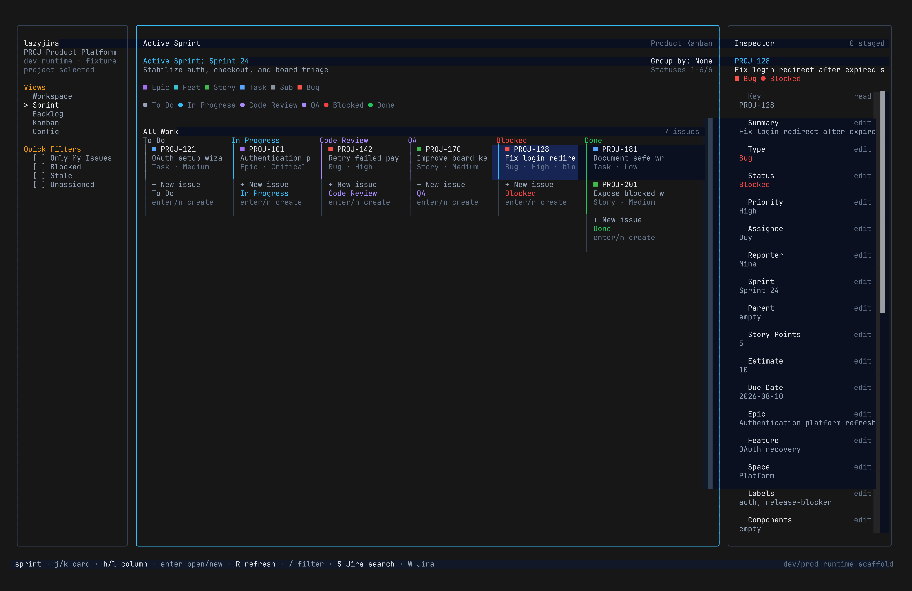

# lazyjira

> A keyboard-first Jira workspace for the terminal.

<p align="center">
  
</p>

_The screenshot shows an earlier fixture build. Current navigation keeps the same three-pane terminal layout and uses the Jira-style `Global`, `Project`, `Quick Filters`, and `Pending` sidebar sections documented below._

`lazyjira` brings project Timeline, Backlog, List, Scrum Active sprints or Kanban Board, issue triage, and rich issue detail into one focused terminal workspace. It keeps lazy/vim muscle memory while making the state of work visible before you drill into a ticket.

## Install

```bash
npm install -g @bojackduy/lazyjira
lazyjira auth login
lazyjira
```

Use `lazyjira dev` to run with bundled fixture data and no Jira credentials.

### Terminal Icons

`lazyjira` uses portable Unicode icons by default. Open the command palette with `;` or `:`, run **Change icon mode**, and preview Nerd Font, Unicode, and ASCII profiles. The selected safe profile applies immediately and is saved in `~/.config/lazyjira/config.json`.

Set `LAZYJIRA_ICON_MODE` for a temporary override with higher precedence than the saved selection:

```bash
LAZYJIRA_ICON_MODE=nerd lazyjira   # requires a patched Nerd Font
LAZYJIRA_ICON_MODE=unicode lazyjira
LAZYJIRA_ICON_MODE=ascii lazyjira
```

Invalid or missing values fall back to `unicode`. Profiles that violate the terminal's one-cell width contract fall back toward Unicode and then ASCII. Font glyph coverage itself cannot be detected reliably, so use the picker preview before selecting Nerd Font. Icons always supplement text labels, so Jira state and destructive confirmations remain readable in every profile.

## Why lazyjira

- **Overview first:** Timeline, Backlog, List, and the board-aware Active sprints/Board view are first-class project destinations.
- **Context stays visible:** inspect an issue beside the board instead of losing your place in the browser.
- **Keyboard-native:** `j/k`, `h/l`, `/`, `?`, `q`, `Tab`, and focused Jira actions keep daily work fast.
- **Safe writes:** stage changes locally, review the exact Jira operations, then apply them deliberately.
- **Jira-native metadata colors:** statuses, priorities, issue types, tickets, and hierarchy badges use Jira metadata whenever Jira exposes it.

## Product Direction

Jira is valuable because it gives teams a shared overview of work:

- What is in the backlog?
- What is in the active sprint?
- What is blocked?
- What is stale?
- What is unassigned?
- What is moving across statuses?
- What needs grooming, ranking, assignment, transition, or comment follow-up?

The terminal app should optimize those workflows first.

Issue details and Confluence-style rich documents still matter, but they are the drill-down surface. The main experience should open on a board, backlog, or workspace overview, not on a single issue reader.

## Product Principles

- Overview first, details second.
- Timeline, Backlog, List, and Active sprints/Board are first-class project screens, not filters over one shared ticket list.
- Active sprint health should be visible without running reports in the browser.
- Rich ticket/document reading should be beautiful when opened, but should not dominate the default workflow.
- Keyboard actions should be one or two keystrokes for common Jira work.
- The UI should feel native to the terminal, not like a cramped copy of the web page.
- Keep lazy-family navigation muscle memory: `j/k`, `h/l`, `g/G`, `/`, `?`, `q`, `Esc`, `Tab`, `Enter`.
- High-impact writes need confirmation and clear before/after context.
- Jira errors should be actionable, not vague.

## Reference Material

This repo includes two reference submodules:

- `lazyjira/`: useful for lazy-style keybindings, pane layout, command flow, and focused Jira actions.
- `jiratui/`: useful for broad Jira feature coverage, forms, metadata-driven fields, comments, links, attachments, and user-facing error handling.

Use them as reference material. Do not copy their product model blindly. Our direction is an overview-first Jira command center.

## Primary Screens

The selected board determines the final project destination: Scrum shows `Active sprints`; Kanban shows `Board`. They share one route and board renderer while retaining separate Jira loading policies.

```text
┌─ Sidebar ─────────────┐┌─ Current project view ─────────────────────────────┐┌─ Inspector ─────────────┐
│ PROJ Product Platform││ Timeline / Backlog / List / Active sprints        ││ PROJ-128                │
│ Delivery · Scrum     ││                                                     ││ Fix login redirect      │
│                      ││                                                     ││ Status: In Progress     │
│ Global               ││                                                     ││ Priority: High          │
│   Workspace          ││                                                     ││ Assignee: Duy           │
│ Project              ││                                                     ││                        │
│   Timeline           ││                                                     ││ e edit · W review       │
│   Backlog            ││                                                     ││                        │
│   List               ││                                                     ││                        │
│ > Active sprints     ││                                                     ││                        │
│ Quick Filters        ││                                                     ││                        │
│   [ ] Assignee: me   ││                                                     ││                        │
│ Pending              ││                                                     ││                        │
│   0 staged changes   ││                                                     ││                        │
└──────────────────────┘└─────────────────────────────────────────────────────┘└─────────────────────────┘
```

### 1. Workspace

The global dashboard shows jump targets, attention queues, recent issues, loaded or remote search results, and staged-change context for the selected project and board.

### 2. Timeline

Timeline projects the independently paged project issue source into a read-only hierarchy and schedule. It opens at Month zoom with loaded parent rows collapsed, then preserves user expansion and zoom choices. It shows loaded/total completeness, discovered Start and Due dates, missing-parent or invalid-hierarchy notices, explicit unscheduled rows, and a textual narrow-terminal fallback. Dated sprint windows may appear as distinct fallback bars, never as invented issue Start or Due dates. A final create row starts the highest configured project hierarchy level.

### 3. Backlog

Scrum Backlog shows collapsible active sprint, future sprint, and backlog groups with rank and move staging. Kanban Backlog shows the board backlog without sprint-only controls. `L` loads the focused source page when Jira has more results.

### 4. List

List is a dense, project-wide paginated issue table independent from board, backlog, and remote search sources. Key and Summary remain visible as the terminal narrows; selection drives the shared inspector, `Space` independently collapses parent rows, and `Enter` opens detail.

### 5. Active Sprints / Board

Scrum Active sprints loads complete active-sprint issue pages and retains sprint goal/date context. Kanban Board uses bounded board pages with explicit `L` load more. Both show workflow columns, create cards, local filters, issue actions, and the shared inspector.

### 6. Issue Detail And Inspector

Purpose: inspect, edit, create, and deeply read one selected item without losing board/backlog context.

Should show:

- Summary, type, status, priority, assignee, reporter, sprint, labels, components.
- Body/description as rich document content in the detail route.
- Comments.
- Subtasks.
- Linked issues.
- Confluence/docs links.
- Attachments.
- Activity/history.
- Actions for transition, assign, priority, comment, edit, copy, and open in browser.
- Staged local edits before applying Jira writes.
- Colored type/status fields that match board/backlog rendering.
- Status/type multiple-choice editing from the current board/Jira metadata.

The right inspector pane is the quick issue/status/edit surface and stays visible, including while the full issue detail route is open. Body editing lives in the detail route, not the inspector: in detail, `Enter` opens the current issue's parent directly from Jira, `e` edits body, `j/k` scroll one line, and `d/u` scroll half a page. Parent jumps keep issue history, so `q`/`Esc` returns through the child before returning to the originating overview. Assignee and Reporter use the same searchable Jira assignable-user picker for the current issue. Typing filters results, Up/Down selects an option, and Enter stages the selected Jira account rather than free text. In text edit mode, printable keys go to the editor and `Ctrl-Enter` stages the current edit. `n` creates a draft issue with context-aware defaults, `x` asks to stage an issue delete, `X` opens a staged-discard popup, `w` applies staged edits/deletes locally, and `W` opens the Jira write review popup. Inside the Jira write popup, `W` is the final remote-apply key: planned and blocked operations remain visible, successful writes clear only their staged rows, and failed writes stay staged with the Jira error. `Enter` opens the full issue detail route for reading; `q`/`Esc` returns to the previous overview.

Board cells always include a trailing `+ New issue` placeholder, even when a column or grouped swimlane is otherwise empty. Selecting that placeholder makes empty columns reachable with `h/l`; pressing `Enter` or `n` creates a draft issue in that exact status and group context.

### 7. Metadata Config

Purpose: inspect board/project metadata without turning the app into a Jira admin console.

In dev/local mode, Board Columns, Statuses, and Issue Types can be staged with `a` add, `e` rename, `c` color, and `x` remove. In production, Jira metadata colors are read-only where Jira exposes them: priorities use Jira priority colors, issue types use their Jira icon color, and tickets or hierarchy badges use Jira Issue color/Epic Color fields. Jira does not expose an independent color for each workflow status, so statuses use semantic terminal colors for blocked, rejected, reopened, done, QA, review, planned, ready, and in-progress states, with Jira's coarse status category as the fallback. `j/k` moves row by row, `d/u` pages through long metadata lists, `w` renders staged metadata locally while keeping it discardable, `X` discards staged changes, and `W` opens the Jira write review with planned and blocked operation previews. Fields and Quick Filters stay read-only but focusable until the model and API support are real.

### 8. Search And Command Palette

Purpose: let users jump anywhere without navigating through panes.

Should support:

- Search issues.
- Search Jira remotely with an explicit command.
- Resolve a numeric key such as `1812` to the current project's issue and match a full key such as `HPCE-1812` exactly.
- Search boards/projects.
- Search Confluence/docs links.
- Run actions by name.
- Show shortcuts next to commands.
- Filter current board/backlog.
- Reuse recent searches and saved filters.

## Navigation Model

The app should use lazy-family muscle memory, adapted to Jira's board and backlog screens.

| Key | Meaning |
|---|---|
| `?` | Help for current context |
| `;` / `:` | Open the command palette |
| `/` | Search or filter current screen |
| `S` | Search Jira remotely |
| `q` | Back, close, or quit depending on context |
| `Esc` | Cancel modal/search/selection |
| `Tab` / `Shift-Tab` | Cycle focus between major regions |
| `h` / `l` | Move between panes or board columns |
| `j` / `k` | Move through cards, rows, options, or document lines |
| `g` / `G` | Jump to top/bottom |
| `d` / `u`, `Ctrl-d` / `Ctrl-u` | Selection-aware half-page down/up |
| `Enter` | Open or confirm |
| `Space` | Select/toggle for bulk work |
| `r` | Refresh current screen |
| `R` | Refresh all visible data |
| `P` | Switch active Jira project/board |
| `1` / `2` / `3` / `4` / `5` | Workspace / Timeline / Backlog / List / Active sprints or Board |
| `s` | Status/transition |
| `a` | Assign |
| `p` | Priority |
| `c` | Comment |
| `e` | Edit focused field/content |
| `m` | Move issue to sprint/backlog/column when applicable |
| `J` / `K` | Rank backlog item down/up |
| `o` | Open in browser |
| `y` | Copy issue key/link |

Shortcuts should be generated into help and command surfaces so users can discover them from inside the app.

## Product Path

Implementation planning artifacts live under `docs/`:

- `docs/BUILD_PLAN.md`: phased build plan and parallel workstreams.
- `docs/TASK_TRACKER.md`: checklist for subagent coordination.
- `docs/OPENTUI_REFERENCE.md`: OpenTUI and OpenCode implementation references.
- `docs/subagents/`: task briefs that can be assigned to parallel implementers.

## Development

- `bun install`: install dependencies.
- `bun run dev`: run the TUI in watch mode with the dev runtime fixture path.
- `bun run dev:prod`: run the TUI in watch mode with the prod runtime Jira API path.
- `bun run start`: run the TUI once with the prod runtime Jira API path.
- `bun run start:dev`: run the TUI once with the dev runtime fixture path.
- `bun run auth:login`: save Jira URL, email, and API token to `~/.config/lazyjira/config.json`.
- `bun run auth:status`: show configured Jira URL/email without printing the token.
- `bun run auth:logout`: remove saved local Jira credentials.
- `bun run typecheck`: validate TypeScript.
- `bun test`: run tests.

### Jira Auth

Atlassian API token auth needs one Jira site URL, email, and API token. `lazyjira` currently supports one local Jira account config.

If no credentials are found, prod runtime opens a guided onboarding walkthrough. Use `lazyjira auth login` when you want to save real Jira credentials outside the TUI. Use `lazyjira dev` or `bun run start:dev` when you want fixture-backed local data without auth.

The same setup is also available outside the TUI:

```bash
lazyjira auth login
```

During development, use:

```bash
bun run auth:login
```

Credentials are stored at `~/.config/lazyjira/config.json` with user-only file permissions. Set `LAZYJIRA_CONFIG=/path/to/config.json` to use a different file. Set `LAZYJIRA_API_TOKEN` to override only the saved token at runtime.

### Jira Project Selection

Press `P` to open the local workspace switcher. It shows recently saved project/board contexts instantly and does not fetch Jira's remote project list. Press `/` in this popup to filter saved workspaces, and press `Enter` to switch to the selected local workspace.

Remote Jira discovery is explicit. From the workspace switcher, press `a` to choose a Jira project. Only then does `lazyjira` fetch one bounded page of remote projects. In remote project mode, press `/` to search all accessible projects through Jira, `[`/`]` to move between result pages, `r` to refresh the current page, and `Enter` to choose one project. `lazyjira` then fetches boards only for that project. A project with one board opens directly; a project with multiple boards shows the Scrum/Kanban chooser. In board mode, press `Enter` to select the final project+board, save it to recent workspaces, make it active, and load/sync only that selected workspace. Press `h` or Backspace from boards to return to the same remote project page and selection, then again to return to local workspaces.

For local smoke testing without Jira credentials, start with `lazyjira dev` or `bun run start:dev`. Press `P` for saved fixture workspaces or `a` to browse the bundled dev projects and boards. Dev runtime loads different fixture tickets for `PROJ`, `MOB`, and `OPS`.

Prod selections are persisted under `prodWorkspace` and `prodRecentWorkspaces`; dev selections are persisted separately under `devWorkspace` and `devRecentWorkspaces`. Auth updates preserve workspace context, and workspace updates preserve the saved API token. On startup with a saved prod workspace, the shell renders first with a loading panel, then loads Jira board metadata, sprints, all active sprint issues, Jira sprint/points/rank field IDs, and a bounded backlog page. Future sprint/backlog/kanban load-more pages, selected issue detail/comments, and explicit remote Jira search are loaded on demand. `W` previews planned and blocked operations; its final confirmation posts only staged comments, while all other Jira writes remain review-only. `/` remains loaded-data filtering only.

### Phase 1: Dev Fixture Board Foundation

Goal: prove the main experience without depending on real Jira data.

- Workspace sidebar.
- Active sprint board with columns and cards.
- Backlog with active/future/backlog sections.
- Inspector for selected issue.
- Right-pane issue inspector/editor plus a main-pane issue detail route with body editing.
- Help surface and command palette.
- Keyboard navigation across board columns, backlog rows, and inspector fields.

Success criteria:

- The app feels useful with dev fixture data.
- A user can understand sprint state at a glance.
- A user can navigate entirely by keyboard.
- A user can open details without losing board/backlog context.

### Phase 2: Read-Only Jira Workspace

Goal: load real Jira overview data safely.

- Projects and boards.
- Board columns/statuses.
- Active sprint issues.
- Backlog issues.
- Future sprints.
- Issue detail in the inspector and full detail route.
- Comments, links, subtasks, attachments, and activity.
- Saved filters and quick filters.

Success criteria:

- The terminal can replace the web UI for checking active sprint and backlog state.
- Refreshing data is explicit and reliable.
- Errors are visible and actionable.

### Phase 3: Safe Daily Actions

Goal: perform common Jira updates faster than the web UI.

- Transition status.
- Assign/reassign.
- Change priority.
- Add/edit comment.
- Edit summary/description.
- Move issue into sprint or backlog.
- Rank issue in backlog.
- Copy/open issue links.

Success criteria:

- Common actions take one or two keystrokes after selection.
- High-impact writes show confirmation with exact issue key and target change.
- Failed writes keep the user in context and show the Jira reason.

### Phase 4: Planning And Triage Power Tools

Goal: make sprint planning and triage better than the web UI for keyboard users.

- Bulk selection.
- Bulk assign/transition/priority.
- Blocked/stale/unassigned views.
- Epic and assignee swimlanes.
- Sprint capacity indicators.
- Recently changed issue feed.
- Personal work queue.
- Saved workspace layouts.

Success criteria:

- A user can groom a backlog without switching to the browser.
- A user can run a sprint triage session from the terminal.
- The app makes risky changes obvious before applying them.

### Phase 5: Rich Docs And Knowledge Context

Goal: make issue reading and linked documentation comfortable.

- Rich issue descriptions.
- Confluence/doc links opened inside the terminal.
- Code blocks, tables, checklists, links, and quotes displayed cleanly.
- Related docs shown next to issue context.
- Search across issues and docs.

Success criteria:

- Users can understand issue context without opening the browser.
- Linked docs are readable enough for daily engineering work.

## What We Are Not Building First

- A clone of every Jira administration screen.
- A terminal replacement for all Jira configuration.
- A document reader that ignores board/backlog workflow.
- A table-only issue browser with no sprint/backlog awareness.

## Open Product Decisions

- Default landing screen: the last saved Workspace or project destination.
- How much of the inspector should always be visible on narrow terminals.
- How much rich issue content belongs directly in the detail route versus future linked-doc reading surfaces.
- How to represent swimlanes without making the board visually noisy.
- Which bulk operations are safe enough for early versions.
- How aggressively to mirror Jira web behavior versus designing terminal-native flows.
